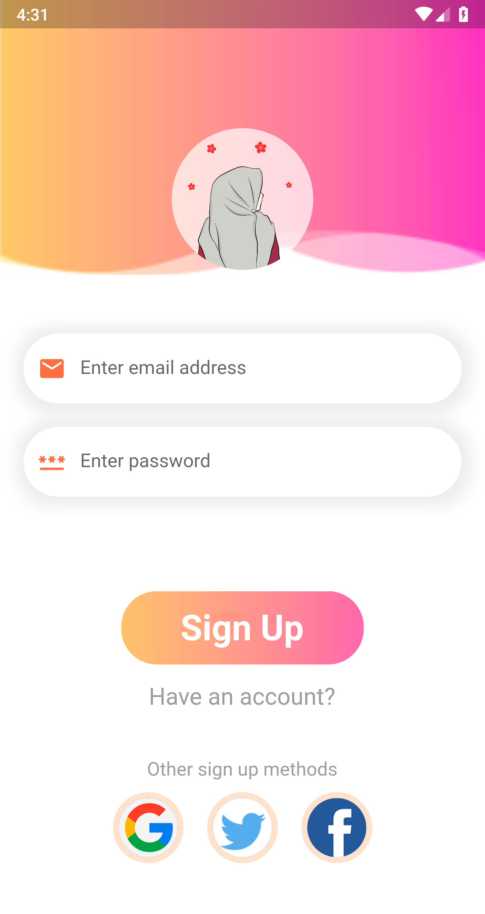
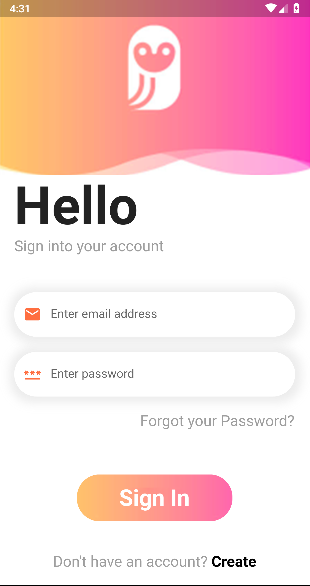
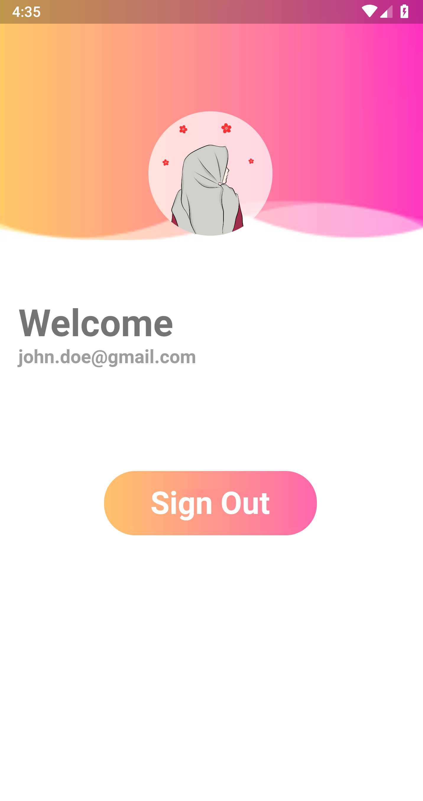

# Firebase Auth App

### This is a simple flutter app showcasing firebase authentication using <b>Email</b> and <b>Password</b>.
 

## Features
<ul> 
    <li><b>GET-X</b> for state management and routing</li>
</ul>
 

## Preview
### Source code is available as per designs below.
 

 

## Contribution
Please fork this repository and contribute back using [pull requests](https://github.com/4xMafole/Firebase-Auth-App/pulls).

Any contributions, large or small, major features, bug fixes, are all welcomed and appreciated but will be thoroughly reviewed.

### Contact - Let's become friends
- 
